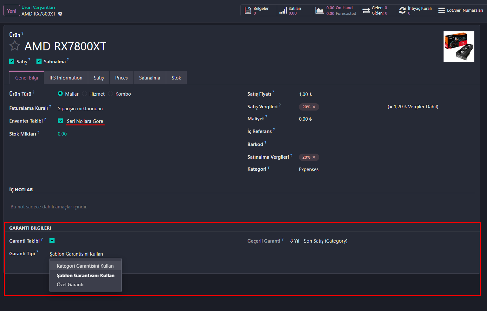
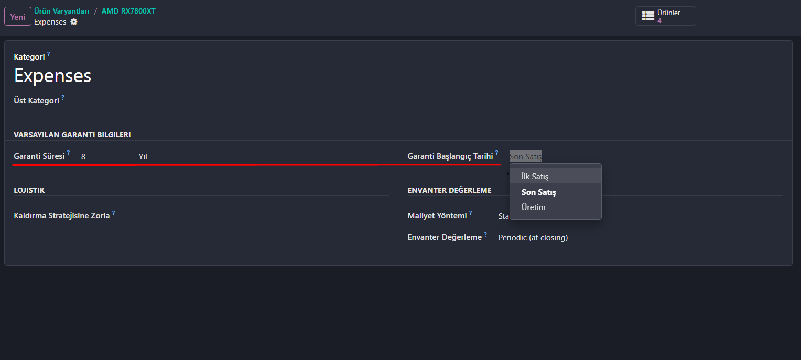
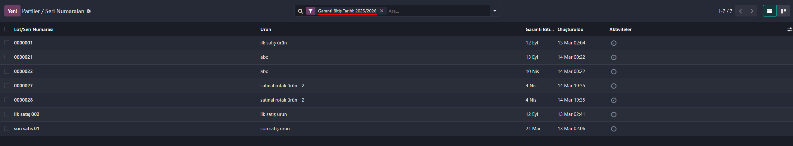

# Odoo 19 için Müşteri Garanti Modülü

## Genel Bakış

**Müşteri Garanti** modülü, Odoo 19 için geliştirilmiş kapsamlı bir garanti yönetim modülüdür. İşletmelerin ürün garantilerini birden fazla seviyede - ürün kategorilerinden bireysel seri numaralarına kadar - takip etmesini sağlar. Modül, müşteri teslimat tarihlerine göre garanti bitiş tarihlerini otomatik olarak hesaplar ve yönetir, böylece garanti takibi zahmetsiz ve doğru hale gelir.

## Temel Özellikler

### 📦 Çok Seviyeli Garanti Yapılandırması
- **Kategori Seviyesi**: Tüm ürün kategorileri için varsayılan garanti koşulları belirleyin
- **Ürün Şablonu Seviyesi**: Kategori ayarlarını ürüne özel garantilerle geçersiz kılın
- **Ürün Varyantı Seviyesi**: Bireysel ürün varyantları için garanti koşullarını ince ayarlayın
- **Esnek Miras Alma**: Her seviye, üst seviyeden miras alabilir veya özel garanti koşulları tanımlayabilir

### ⏰ Akıllı Garanti Hesaplama
Modül üç farklı garanti başlangıç tarihi türünü destekler:
- **İlk Satış**: Garanti ilk müşteri teslimatında başlar (uzun raf ömrüne sahip ürünler için ideal)
- **Son Satış**: Garanti her müşteri teslimatında sıfırlanır (yeniden satılan ürünler için kullanışlı)
- **Üretim**: Garanti üretim tarihinden başlar (bozulabilir veya zamana duyarlı ürünler için mükemmel)

### 🔢 Seri Numarası Takibi
- Serileştirilmiş ürünler için otomatik garanti bitiş tarihi hesaplama
- Ürünler müşterilere teslim edildiğinde garanti tarihleri otomatik olarak atanır
- İadeler ve yeniden satışların akıllı şekilde yönetimi
- Garanti durumunu doğrudan seri numarası kayıtlarında görüntüleme

### 📊 Garanti Bilgisi Görüntüleme
- **Etkin Garanti** alanı, aktif garantiyi kaynağıyla birlikte gösterir (Kategori/Şablon/Varyant)
- Garanti süresi, birimi (Gün/Hafta/Ay/Yıl) ve başlangıç türünün net görünürlüğü
- Bir bakışta anlaşılır garanti bilgisi

## Ekran Görüntüleri

### Ürün Kategorisi Garanti Yapılandırması

Kategori seviyesinde varsayılan garanti koşullarını ayarlayın, bu koşullar otomatik olarak o kategorideki tüm ürünlere uygulanır.

### Ürün Varyantı Garanti Yönetimi

Bireysel ürün varyantları için garanti ayarlarını yapılandırın; şablon veya kategoriden miras alma veya özel garanti koşulları belirleme seçeneğiyle.

### Garanti Liste Görünümü

Tüm garanti bilgilerini etkin garanti detaylarıyla birlikte kullanışlı bir liste formatında görüntüleyin.

## Yapılandırma

### Kategori Garantilerini Ayarlama

1. **Envanter > Yapılandırma > Ürün Kategorileri** menüsüne gidin
2. Bir kategori seçin veya yeni bir tane oluşturun
3. **Garanti** sekmesinde:
   - **Garanti Süresi**'ni ayarlayın (örn: 24)
   - **Garanti Birimi**'ni seçin (Gün/Hafta/Ay/Yıl)
   - **Garanti Başlangıç Tarihi** türünü seçin (İlk Satış/Son Satış/Üretim)

### Ürün Garantilerini Yapılandırma

1. **Envanter > Ürünler > Ürünler** menüsüne gidin
2. Bir ürün açın veya yeni bir tane oluşturun
3. **Garanti** sekmesinde:
   - **Garanti Takibi** onay kutusunu etkinleştirin
   - **Garanti Türü**'nü seçin:
     - **Kategori Garantisini Kullan**: Ürün kategorisinden miras al
     - **Özel Garanti**: Ürüne özel garanti koşulları belirle
   - Özel seçilirse, süre, birim ve başlangıç türünü yapılandırın
   - Aktif garanti yapılandırmasını görmek için **Etkin Garanti**'yi görüntüleyin

### Ürün Varyantı Garantileri

Varyantlı ürünler için:
1. Ürün şablonunu açın
2. **Varyantlar** akıllı butonuna tıklayın
3. Bir varyant seçin
4. **Garanti** sekmesinde:
   - **Garanti Takibi**'ni etkinleştirin (varsayılan olarak şablondan miras alınır)
   - **Garanti Türü**'nü seçin:
     - **Şablon Garantisini Kullan**: Ürün şablonundan miras al
     - **Kategori Garantisini Kullan**: Ürün kategorisinden miras al
     - **Özel Garanti**: Varyanta özel garanti koşulları belirle

## Nasıl Çalışır

### Garanti Başlangıç Türü Davranışı

- **İlk Satış**: Garanti tarihi yalnızca ilk müşteri teslimatında ayarlanır. Sonraki satışlar garantiyi değiştirmez.
- **Son Satış**: Garanti tarihi her müşteri teslimatında güncellenir. İadeler garanti tarihini sıfırlar.
- **Üretim**: Garanti tarihi, müşteri teslimatından bağımsız olarak ürün üretimden çıktığında ayarlanır.

### İade Yönetimi

Bir ürün müşteriden iade edildiğinde:
- Garanti türü **Son Satış** ise, garanti bitiş tarihi temizlenir
- Garanti türü **İlk Satış** veya **Üretim** ise, garanti tarihi değişmeden kalır

## Destek ve Katkı

- **Sorunlar**: Hataları bildirin veya özellik talep edin [GitHub Issues](https://github.com/SalihKalender28/sk_customer_product_warranty/issues)
- **Katkılar**: Pull request'ler memnuniyetle karşılanır!
- **Yazar**: Salih Kalender
- **Web Sitesi**: [https://github.com/SalihKalender28](https://github.com/SalihKalender28)

## Lisans

Bu modül LGPL-3 lisansı altında lisanslanmıştır. Detaylar için LICENSE dosyasına bakın.

---

**Not**: Bu modül Odoo 19.0 gerektirir ve Odoo'nun temel işlevselliğinin bir parçası olan `product` ve `stock` modüllerine bağımlıdır.
